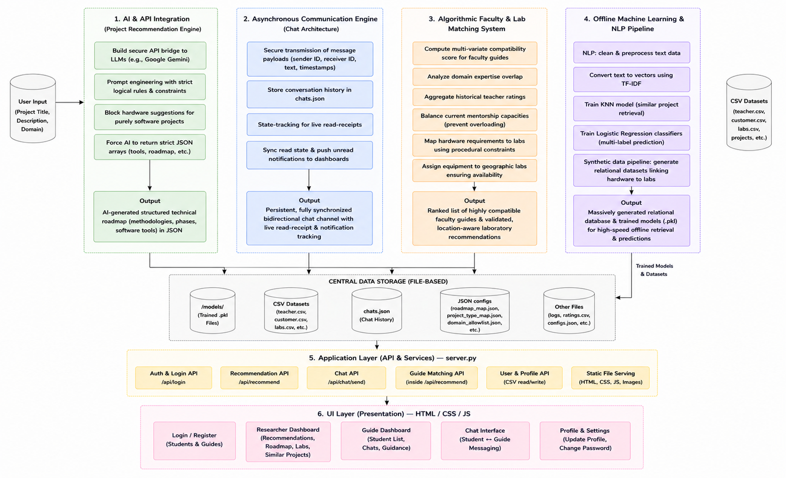

# ML R&D App - Research Recommendation Platform

An intelligent platform designed to help students discover relevant research projects, get matched with faculty guides, and collaborate seamlessly. The application leverages Machine Learning and generative AI (via the Groq API) to provide highly personalized research recommendations, equipment requirements, and tailored project roadmaps.

## Architecture

The project follows a clean separation of concerns, divided into a distinct frontend, backend, model repository, and dataset store.



## Folder Structure

- **`backend/`**: Contains all Python logic including the HTTP server (`server.py`), recommendation engine (`test.py`), AI integration modules (`ai_engine.py`), and data/model generation scripts.
- **`frontend/`**: Contains the client-side HTML, CSS, and JavaScript files (`app.html`, `guide_dashboard.html`, `login.html`).
- **`datasets/`**: Stores all the synthesized `.csv` datasets (student info, teacher datasets, lab datasets, basic and roadmap training datasets).
- **`models/`**: Houses the trained Scikit-Learn `.pkl` models (TF-IDF vectorizers, KNNs, Label Encoders) used for offline recommendation mapping.
- **`chats.json` / `read_status.json`**: Simple JSON stores that hold live chat history and read receipt data between students and teachers.

---

## Getting Started & Execution

Follow these steps to run the application on your local machine.

### 1. Prerequisites

Ensure you have Python 3.8+ installed. You will also need your Groq API key set up in your environment to power the generative AI features.
Create a `.env` file in the root directory and add your key:

```env
GROQ_API_KEY=your_groq_api_key_here
```

### 2. Install Dependencies

Install all required Python packages:

```bash
pip install -r requirements.txt
```

### 3. Execution

The application is completely self-contained. To run the platform, simply start the backend server from the project's root directory:

```bash
python backend/server.py
```

*Note: The server will automatically locate the frontend files and datasets using relative paths.*

### 4. Access the Application

Once the server indicates it is running (`Serving at http://127.0.0.1:8000/`), open your web browser and navigate to:

- **[http://localhost:8000/](http://localhost:8000/)** (Redirects to the login or app portal)

---

## Features & Usage Guide

### Student Portal (`app.html`)

1. **Research Recommendations**: Enter your domain of interest, skill level, and project type. The system queries the ML model to find similar past projects and queries the AI engine to generate a personalized methodology, required equipment, and tools.
2. **Faculty Matching**: Based on your desired research domain, the `teacher_engine.py` filters through `teacher_dataset.csv` to find the most relevant faculty members, factoring in proximity, experience, and their average ratings.
3. **Communication & Account Tiers**: 
   - **Free Users**: Have full access to the AI-powered research recommendations and can view matched faculty members and project roadmaps.
   - **Premium Users**: Unlock the exclusive **Direct Faculty Chat** feature, enabling them to directly message and seek active mentorship from faculty guides.
4. **Faculty Ratings**: After receiving mentorship, students can leave ratings for their guides. These live ratings are aggregated and directly influence the faculty matching algorithm.

### Guide / Teacher Dashboard (`guide_dashboard.html`)

1. **Student Tracking**: Teachers can view all students who have reached out to them or requested mentorship.
2. **Chat Management**: View unread messages and interact with premium students directly from the dashboard.
3. **Analytics & Ratings**: The dashboard provides simple statistics on how many queries the faculty member has successfully mentored, alongside their live rating score.

### Re-training the Machine Learning Pipeline

If you wish to reset or rebuild the foundational data, the backend includes scripts to synthesize data and retrain the classification models. You can execute these sequentially from the root folder:

```bash
# 1. Synthesize student and project training data
python backend/generate_data.py

# 2. Synthesize lab availability datasets
python backend/generate_labs.py

# 3. Train the TF-IDF, KNN, and multi-label classifiers 
python backend/train_model.py
```

*Executing `train_model.py` will update all the `.pkl` files in the `models/` directory, immediately updating the platform's offline inference capabilities.*
